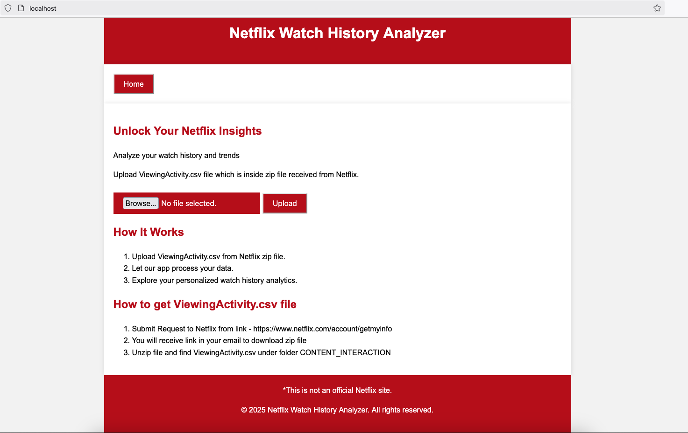

# netflix-data-analyzer
This project provides a UI to upload ViewingActivity file from zip file which is received from Netflix. 
Once Uploaded, this application will analyze that file and show information in easy format.

# About personal information zip file from Netflix
Zip file of your personal information can be requested to Netflix from [here](https://www.netflix.com/account/getmyinfo)
Information about this file can be found [here](https://www.netflix.com/account/getmyinfo)

## How to start this application

### Using docker
- Clone this repo and run `docker compose up --build`

### Using maven
- Clone this repo and run `mvn spring-boot:run`

### Verify at - http://localhost/

